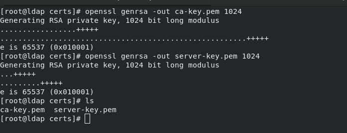

# LDAPS: Accés segur al servidor LDAP
## Ha d’utilitzar els seus propis certificats digitals i ha de permetre tant connexions ldaps com connexions ldap amb starttls.
## Utilitzarem sempre una autoritat de certificació CA anomenada Veritat Absoluta, que és qui emetrà tots els certificats per a l’organització edt.org. Aquí caldrà un certificat de servidor ldap.edt.org
## Un client ldap ha de poser-se conectar al servidor ldap usant ldaps connectant al port privilegiat, però també usant ldap (port insegur) i usant startls per generar una connexió segura.

### Pasos al server:
1. Crear les claus necessaries pel certificat del servidor:
```
[root@ldap certs]# openssl genrsa -out ca.key 1024
[root@ldap certs]# openssl genrsa -out server.key 1024
```


2. Crear entitat CA propia (Veritat Absoluta):
```
[root@ldap certs]# openssl req -new -x509 -nodes -sha1 -days 365 -key ca.key -out ca.crt
```


3. Creem una petició de certificat request per enviar a l'entitat certificadora CA:
```
[root@ldap certs]# openssl req -new -key server.key -out server.csr
```


4. Creem/editem el fitxer de configuració de la generació de certificats, **ca.conf** (indica què certifiquen):
```
basicConstraints = critical,CA:FALSE
extendedKeyUsage = serverAuth,emailProtection
```

5. Hem de fer que l'autoritat CA signi el certificat:
```
[root@ldap certs]# openssl x509 -CA ca.crt -CAkey ca.key -req -in server.csr -days 365 -sha1 -extfile ca.conf -CAcreateserial -out server.crt
```

6. Una vegada creats els certificats, el copiem a **/etc/openldap/certs**; i afegim les següent línies al fitxer de configuració de ldap, **slapd.conf**:
```
[...]
# Allow LDAPv2 client connections. This is NOT the default.
allow bind_v2
pidfile               /var/run/openldap/slapd.pid
TLSCACertificateFile  /etc/openldap/certs/ca.crt
TLSCertificateFile    /etc/openldap/certs/server.crt
TLSCertificateKeyFile /etc/openldap/certs/server.key
TLSVerifyClient       never
TLSCipherSuite        HIGH:MEDIUM:LOW:+SSLv2
[...]
```

7. Tot seguit, editem el fitxer **ldap.conf** (editem lo següent):
```
BASE dc=edt,dc=org
URI ldaps://ldap.edt.org

#TLS_CACERTDIR  /etc/openldap/certs  #cal comentar aquesta linia
TLS_CACERT /etc/openldap/certs/ca.crt
```

8. Finalment, a l'hora de engegar el servidor ldap, hem d'utilitzar **-h** per a que faci diferents bind depenent del mètode que s'utilizi:
- **ldap:///** --> port 389
- **ldaps:///** --> port 636 (TLS)
```
/sbin/slapd -d0 -h "ldap:/// ldaps:///"
```

### Pasos al client:
1.  
